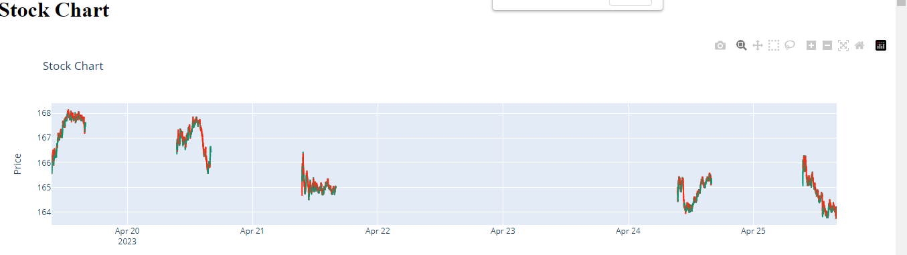
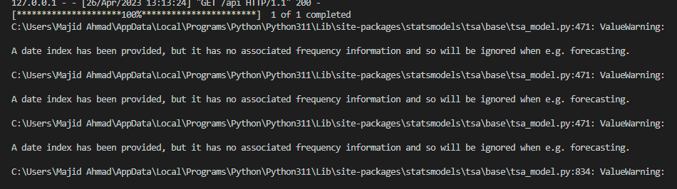
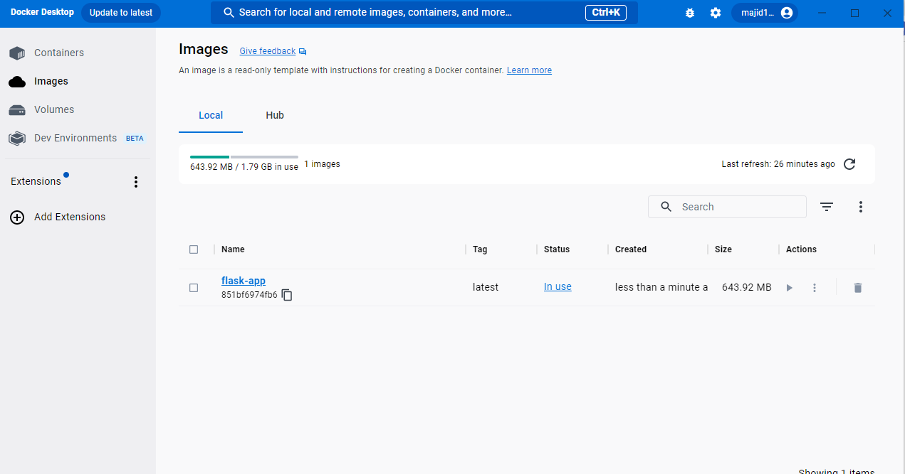
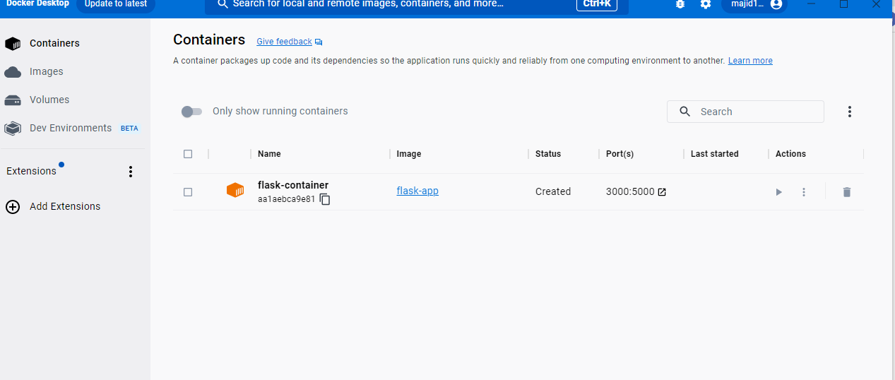
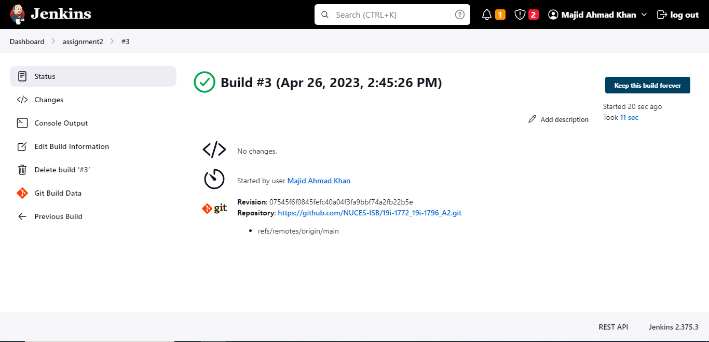

# CI/CD Pipeline for Machine Learning System -->
This repository contains a CI/CD pipeline for a machine learning system, implemented using the following tools:

# MLOPS Assignment#2
# 19I-1772 Abdullah, 19I-1796 Majid Ahmad

Github and Github Actions
Flask
Jenkins
Docker
Live Stream Selection
Initially, we selected a live stream as input to our system. In this example, we chose the Pakistan Stock Exchange. You can modify this to suit your needs.

# Model Training
We trained several machine learning models on the selected live stream using Python and its libraries, such as scikit-learn and pandas. You can find the code for training the models in the models folder.

# Flask Application
We wrapped the trained models in a Flask application, which can be used in two modes:
Screenshots

# Live Dashboard
The live dashboard shows live data from the selected stream along with the predictions of our machine learning models. It also displays different metrics of the models. You can access the dashboard by running the Flask application and navigating to http://localhost:5000.

Live Dashboard Screenshot
# Prediction Service
The Flask app also provides a prediction service, where a user can provide an instance of the live data to get the accuracy of the models. You can access this service by making a POST request to http://localhost:5000/predict with the live data in JSON format.

Delivery Phase
The delivery phase is implemented using Jenkins. Jenkins is connected to our Github repository and is triggered on appropriate events, such as pushes and pull requests. When Jenkins is triggered, it initiates a build and creates a Docker image of our Flask application. This image is then pushed to our public Docker registry and hosted as a web application.

# Jenkins Pipeline Screenshot

Conclusion
This CI/CD pipeline demonstrates a workflow for developing and deploying machine learning systems. You can modify and extend this pipeline to suit your specific needs. If you have any questions or feedback, feel free to contact us.

